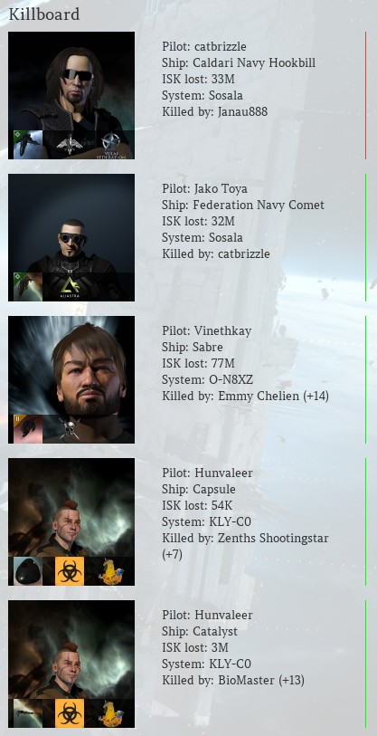

# EVE Online Killboard Widget for WordPress

## Show your latest kill and losses in your WordPress Sidebar

This widget connects to zKillboard and parses the latest x-amount of kills for you to display in your sidebar.

### Screenshot

### Hint
This plugin works best with WordPress themes utilizing the Bootstrap Framework. If your Theme doesn't use it, you might end up having to tweak it here and there a bit.
Works best with the [EVE Online WordPress Theme](https://github.com/ppfeufer/eve-online-wordpress-theme)

### Installation
- Simply [download the archive](https://github.com/ppfeufer/eve-online-killboard-widget/archive/master.zip) or one of the [releases](https://github.com/ppfeufer/eve-online-killboard-widget/releases)
- Unzip it
- Rename the folder to `eve-online-killboard-widget` (This is important, otherwise automatic updates might not work as expected)
- Copy the folder into your plugin directory in your WordPress installation.

### Set Up
- Find your widget in Appearance -> Widgets and select the EVE Online Killboard Widget.
- Drag and drop this widget into a sidebar and set it up there. The settings are self explaining, I hope.

### Additional Information
- [License](LICENSE)
- [Changelog](CHANGELOG.md)
